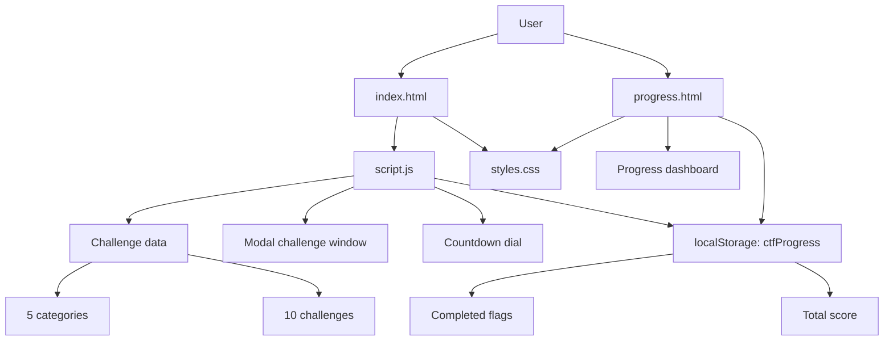

## JARVIS CTF Platform

A browser-based Capture The Flag training platform with a dark cyber-security theme, fixed challenge categories, a progress dashboard, and client-side flag validation.

## Overview

This project is a static frontend challenge platform. All challenge data, rendering logic, and progress tracking live in the browser. Completion state is stored in `localStorage`, so progress persists across reloads on the same device and browser.

## Architecture



## Project Structure

| File | Purpose |
| --- | --- |
| [index.html](index.html) | Main challenge landing page with categories, modal challenge window, and countdown dial |
| [progress.html](progress.html) | Dedicated progress dashboard with summary cards and category completion bars |
| [script.js](script.js) | Challenge definitions, rendering logic, flag submission, countdown updates, and storage handling |
| [styles.css](styles.css) | Shared UI styling for both pages |
| [FLAGS.md](FLAGS.md) | Flag reference used by the platform |

## Features

- 5 challenge categories with 10 total challenges
- Client-side flag submission and completion tracking
- Dedicated progress dashboard
- Persistent progress using browser `localStorage`
- Countdown dial that shows remaining contest time
- Dark, pointed cyberpunk-style interface

## How To Run

This app does not need a build step, package manager, or backend.

### Option 1: Open directly

1. Open [index.html](index.html) in a browser.
2. Select a challenge category.
3. Click a challenge tile to open the overlay window.
4. Submit the flag in the required format: `SAUR{...}`.
5. Open the progress page from the navbar to review completion.

### Option 2: Use a local static server

If you prefer serving the files locally:

```bash
python -m http.server 8000
```

Then open:

```text
http://localhost:8000/
```

You can also use any static server, such as `npx serve`, VS Code Live Server, or a simple IIS/Apache/Nginx setup.

## Progress Data

The platform stores progress in browser storage under the `ctfProgress` key.

Saved data includes:

- Completed challenge IDs
- Total score

To reset progress, open the browser console and run:

```javascript
localStorage.removeItem('ctfProgress');
location.reload();
```

## Challenge Format

- Easy challenges are worth 100 points.
- Hard challenges are worth 200 points.
- The correct submission format is `SAUR{flag_value}`.

## Notes

- The app is fully client-side, so the flags are visible in the source code.
- This makes it suitable for training, demonstrations, and lightweight CTF hosting.
- Because the app is static, deploy it anywhere that can serve HTML, CSS, and JavaScript files.

## Browser Support

- Chrome or Chromium-based browsers
- Firefox
- Edge
- Safari

## License

This project is provided for educational use.
---

**Enjoy hacking! 🚀⚡**
